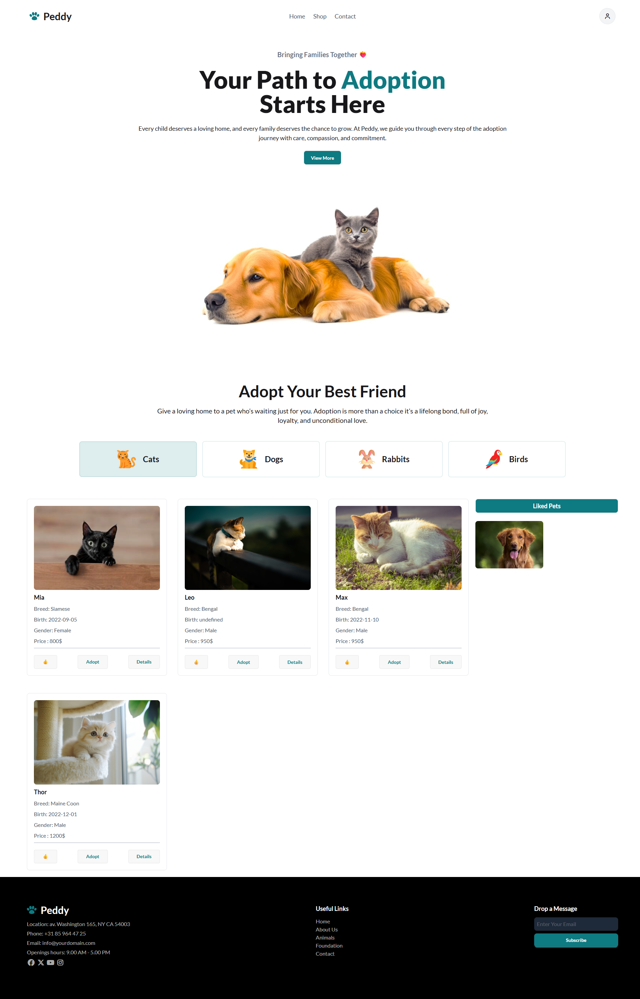

Pet Adoption Web 

A modern and user-friendly Pet Adoption Website built with HTML, CSS, and JavaScript.
This project helps users explore pets by category (Cats, Dogs, Rabbits, Birds) and adopt their favorite furry friends.

🔗 Live Demo: https://obaidullah-miazi-dev.github.io/pet-adoption-web/

🚀 Features

- Homepage with adoption introduction & hero section

- Category-based Filtering (Cats, Dogs, Rabbits, Birds)

- Like & Adopt Options for each pet

- Pet Details Card with breed, birth date, gender, and price

- Liked Pets Section to save favorites

- Footer Section with contact info, useful links, and subscription form

🛠️ Tech Stack

HTML5

CSS3 (custom styling)

JavaScript (ES6)

API Data (from Programming Hero API)

📂 Project Structure
pet-adoption-web/
│-- index.html
│-- style.css
│-- app.js
│-- assets/
│   │-- images/
│   │-- icons/

🔧 How to Run Locally

Clone the repository:

git clone https://github.com/obaidullah-miazi-dev/pet-adoption-web.git

Navigate to the project folder:

cd pet-adoption-web

Open index.html in your browser.

📸 Full Preview  

🌟 Future Improvements

Add a Search & Filter feature for pets

Implement Responsive Design for all devices

Connect to a real backend for storing adoption requests

Add User Authentication for favorites & adoptions

🤝 Contributing

Contributions are welcome! If you’d like to improve this project:

Fork the repo

Create a new branch (feature-xyz)

Commit your changes

Submit a Pull Request

👨‍💻 Author

Obaidullah Miazi  

GitHub: obaidullah-miazi-dev  

Email: obaidullahmiazi.dev@gmail.com  

Linkedin: https://www.linkedin.com/in/obaidullah-miazi/

📜 License

This project is open-source and available under the MIT License.